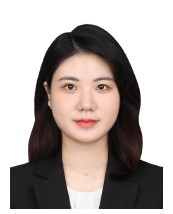

## Ph.D. Students

  
  <h3>Jiin Han</h3>
  
<strong>M.S/Ph.D Combined</strong>

  
<strong>Multi-modal Learning</strong>

  
<stronggkswldls8671@naver.com</strong>

## M.S. Students

# 

#   
#   <h3>Eun Won Kim</h3>
#   
<strong>M.S. Student</strong>

#   
<strong>Research interests:</strong> Dialogue System

#   
<strong>Email:</strong> eun1k@sogang.ac.kr

# 
